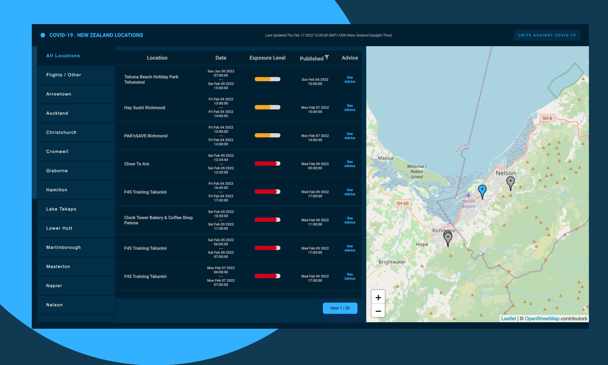

  

  <a href="https://stocks50.herokuapp.com/" target="__blank">
    <h2 align="center">Covid-19. New Zealand Locations of Interest</h2>
  </a>

  

    View the latest locations of Interest in New Zealand as published by the Ministry of Health NZ. 

#### Timing and sources

A Public API offered by the [Ministry of Health - Github](https://github.com/minhealthnz/nz-covid-data/tree/main/locations-of-interest) consisting of a single JSON endpoint.

Currently all data sources are expected to update once an hour, on the hour, but this schedule may be changed.
